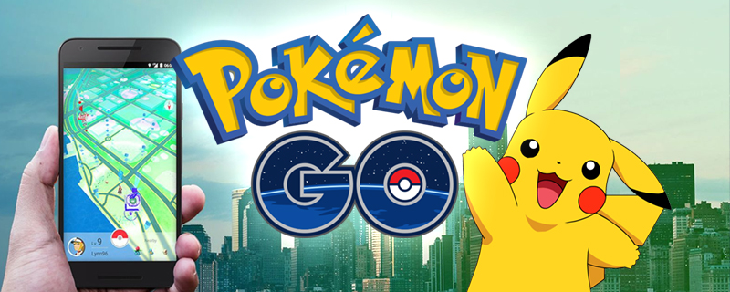
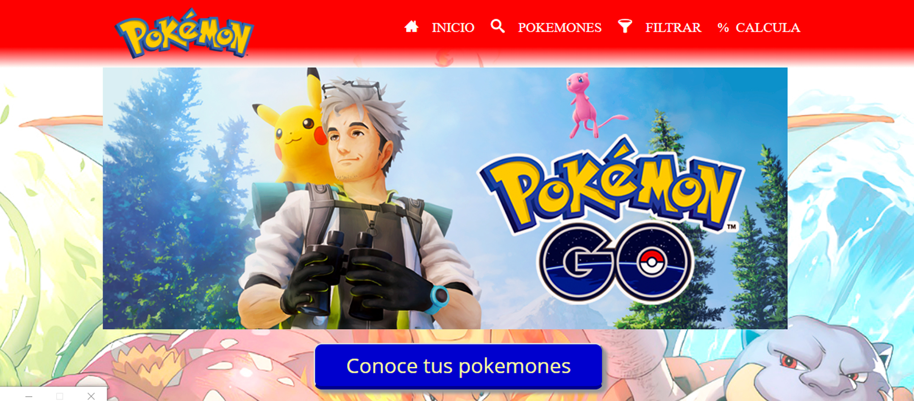
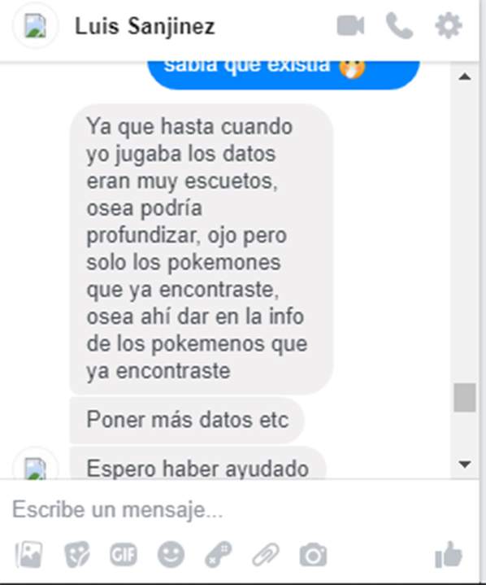
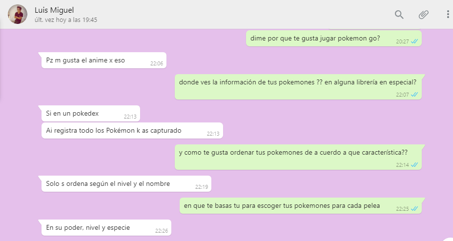
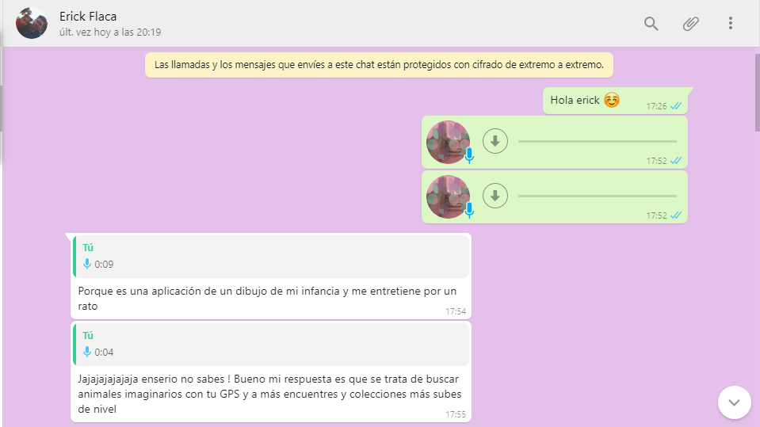
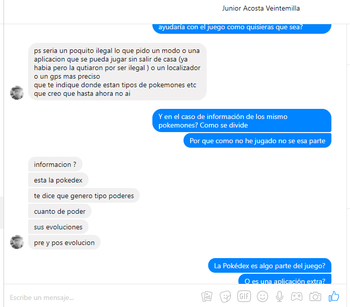
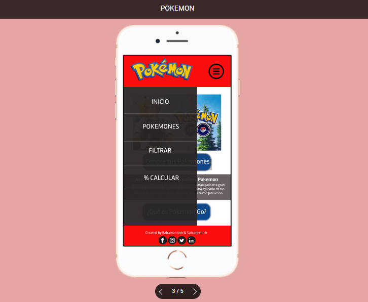

# Data Lovers

## Índice

* [Preámbulo](#preámbulo-pokemon-Go)
* [Definición del Producto](#resumen-del-proyecto)
* [Diseño de Interfaz de Usuario](#diseño-de-la-interfaz-de-usuario)
* [Implementación de la Interfaz de Usuario (HTML/CSS/JS)](#Implementación-de-la-Interfaz-de-Usuario-(HTML/CSS/JS))
* [Checklist](#checklist)

***

## Preámbulo  Pokemon Go

Últimamente, podemos ver un fenómeno muy interesante: el juego [Pokémon Go](https://www.youtube.com/watch?v=xnnGSH5N4f8&t=163s) los jóvenes van caminando con los ojos pegados a la pantalla de su móvil, mientras que hacen unos actos raros con mucha alegría. A lo mejor tienen preguntas: ¿quiénes son? ¿qué hacen? De hecho, están jugando a Pokémon.
Sin duda, Pokémon Go está causando un furor sin precedentes entre mayores y pequeños. Sobre todo, los jóvenes a finales de los 90 no quieren perderlo como un repaso del recuerdo infantil.

\* Puedes ver la interfaz construida en este  [link]
(https://solangesalvatierra.github.io/lim-2018-11-bc-core-am-data-lovers/src/).

## Resumen del proyecto

En el proyecto “Data lovers” elegimos como tema Pokémon Go, con el objetivo de contribuir el uso del juego, pensando crear una galería digital que pueda mostrar información sobre los podémonos de tal modo administrarlos y así poder ayudar con una búsqueda mas efectiva, entre otras funciones. Pero para lograr este proyecto y tener claras nuestras funciones, decidimos empezar definiendo nuestros USUARIOS mediante entrevistas y buscar una necesidad que ellos tengan al respecto.
ENTREVISTAS 
Formulamos las siguientes preguntas:
* ¿Por qué te gusta jugar Pokémon Go?
* ¿Sientes que alguna librería te brinda información necesaria de los Pokemones?
* ¿En qué te basas tu para escoger un pokémon?
* ¿Cómo te gustaría ordenar tu librería de pokemones?
* ¿Si te dieran la opción de adicionar algo a tu librería que es lo que te gustaría?
    - Algunas de nuestras entrevistas 

Como verán en las imágenes, cada usuario tenía una idea diferente como también tenían necesidades en común. Gracias a la entrevista y a cada usuario logramos obtener 4 historias definidas, las cuales nos ayudaron a obtener una mejor visión de nuestro proyecto.

COMO DEFINIMOS NUESTRO USUARIO
Realizandonos las siguientes preguntas:
1.¿Quiénes son los principales usuarios de producto?
* Personas que jueguen o ayan jugado Pokemon GO.
2.¿Cuáles son los objetivos de estos usuarios en relación con el producto?
Nuestro principal objetivo es darle una librería fácil de usar de acuerdo a sus POKEMONES recaudados.
3.¿Cuáles son los datos más relevantes que quieren ver en la interfaz y por qué?
* Información de Todos Los POKEMONES, para que así puedan identificarlos y usarlos de manera
adecuada.
4.¿Cuándo utilizan o utilizarían el producto?
* Antes de atrapar sus pokemones o cuando ya los tengas atrapados y quieran tener información sobre cada pokemon para alguna batalla.
* O cuando quieran ORDENAR su galeria de algun modo en espcifico, realizar FILTRADOS deacuerdo
a sus tipos y por ultimo saber cuanto de porcentaje por tipo tiene en su galeria de pokemones. 

### Historias

#### Historia 1

COMO: Jugador de Pokémon Go.

QUIERO: Ver a todos mis pokemones en mi galeria.

PARA: Saber que pokémones hay.

CRITERIOS DE ACEPTACIÓN

- La página debe mostrar a todos los pokemones.
- La página debe mostrar a los pokémones con sus respectivos       nombres y ID.
- Debe pasar Test unitario.
- Debe ser responsive.

#### Historia 2

COMO: Jugador de Pokémon Go.

QUIERO: Poder ordenar los pokemones Alfabeticamente, y de manera AScendente y Descendente por el ID.

PARA: poder conocer cada uno de ellos.

CRITERIOS DE ACEPTACIÓN

- La página debe permitir ordenar de A-Z y de Z-A.
- El usuario debe poder seleccionar el orden que desee obtener.
- Debe pasar Test unitario.
- Debe ser responsive.

#### Historia 3

COMO: Jugador de Pokémon Go.

QUIERO: Filtrar los pokémon según el tipo.

PARA: Poder saber que pokémon puedo obtener según el tipo.

CRITERIOS DE ACEPTACIÓN

- La página debe permitir filtrar según el tipo.
- El usuario debe poder seleccionar el tipo de cada pokemon.
- Debe pasar Test unitario.
- Debe ser responsive.

#### Historia 4

COMO: Jugador de Pokémon Go.

QUIERO: saber el porcentaje de pokemones que tengo segun el tipo de pokemon.

PARA: Saber el porsentaje.

CRITERIOS DE ACEPTACIÓN

- La página debe calcular el porsentaje de pokmones segun su tipo.
- Debe pasar Test unitario.
- Debe ser reponsive.

## Diseño de Interfaz de Usuario
Las preguntas estaban enfocadas a la funcionalidad, necesidad y expereciencia del usuario y el prototipo una idea en proceso de cambios. De esta forma obtuvimos nuestras historias de usuario definidas, para poder realizar nuestro maquetado en zeplin y figma.

PROTOTIPO DE BAJA FIDELIDAD 
Nuestras primeras maquetas la trabajamos en baja fidelidad, teniendo en cuenta  las 4 historias de USUARIO, en las cuales identificamos nuestro sistema de flujo. Nuestra primera historia ………… , es mostrar todos los pokemones de esa forma continuamos trabajando con nuestra segunda historia que se basaba en ordenar ………………,  la tercera historia filtrado por tipos ……………. Y por ultimo nuestra ultima historia  se trata de poder calcular el porcentaje de Pokemones según su tipo, para poder obtener mayor información de cuantos  Pokemones de cada tipo tenemos.

 

PROTOTIPO DE ALTA FIDELIDAD
Para continuar con nuestro Proyecto,mostramos nuestro trabajo a nuestras compañeras, y con nuestro Squad, en donde obtuvimos muchos feetback  de fuentes de letra, posiciones, imágenes, en pocas palabras estilos, de esa forma  obtuvimos  nuestra segunda maqueta, y pasamos a realizar  el Figma y Zeplin, gracias a cada feetback logramos obtener una mejor versión.

\* Puedes encontrarlo en este  [link]
(https://www.figma.com/proto/N7gOSGXweECTVuD3637hsUJr/POKEMON?node-id=0%3A1&scaling=scale-down&redirected=1).

## Implementación de la Interfaz de Usuario (HTML/CSS/JS)
El proceso de nuestro proyecto al comienzo fue de aprendizaje, vimos más del juego ya que una de nosotras no había jugado para nada el juego, conocimos más de nosotras mismas, entre otras cosas. Sin embargo, no fue tan fácil no saber por dónde comenzar, como verán comenzamos con la maqueta y por ello comenzamos con CSS y HTML. Sin embargo, nos dimos cuenta en nuestro segundo SPRINT que debíamos comenzar con JS (funcionalidades). Realmente nos bloqueamos por casi una semana, pero logramos obtener nuestros primeros resultados en consola. Teníamos resultados muy lentos, hasta que con ayuda y motivación de Diegoy los Couches, logramos avanzar un 70% mas rápido, obteniendo resultado y sobre todo aprendiendo cada vez más.
Una de las mejores experiencias que ambas tenemos es la hermosa sensación de que un código o interfaz nos salga como planeemos, incluso logramos mejorar nuestra expectativa.

\* Puedes encontrarlo en este  [link]
(https://app.zeplin.io/project/5c3cac78df5be3be058bc082).

## Checklist

* [ ] Usa VanillaJS.
* [ ] No hace uso de `this`.
* [ ] Pasa linter (`npm pretest`)
* [ ] Pasa tests (`npm test`)
* [ ] Pruebas unitarias cubren un mínimo del 70% de statements, functions y
  lines y branches.
* [ ] Incluye _Definición del producto_ clara e informativa en `README.md`.
* [ ] Incluye historias de usuario en `README.md`.
* [ ] Incluye _sketch_ de la solución (prototipo de baja fidelidad) en
  `README.md`.
* [ ] Incluye _Diseño de la Interfaz de Usuario_ (prototipo de alta fidelidad)
  en `README.md`.
* [ ] Incluye link a Zeplin en `README.md`.
* [ ] Incluye el listado de problemas que detectaste a través de tests de
  usabilidad en el `README.md`.
* [ ] UI: Muestra lista y/o tabla con datos y/o indicadores.
* [ ] UI: Permite ordenar data por uno o más campos (asc y desc).
* [ ] UI: Permite filtrar data en base a una condición.
